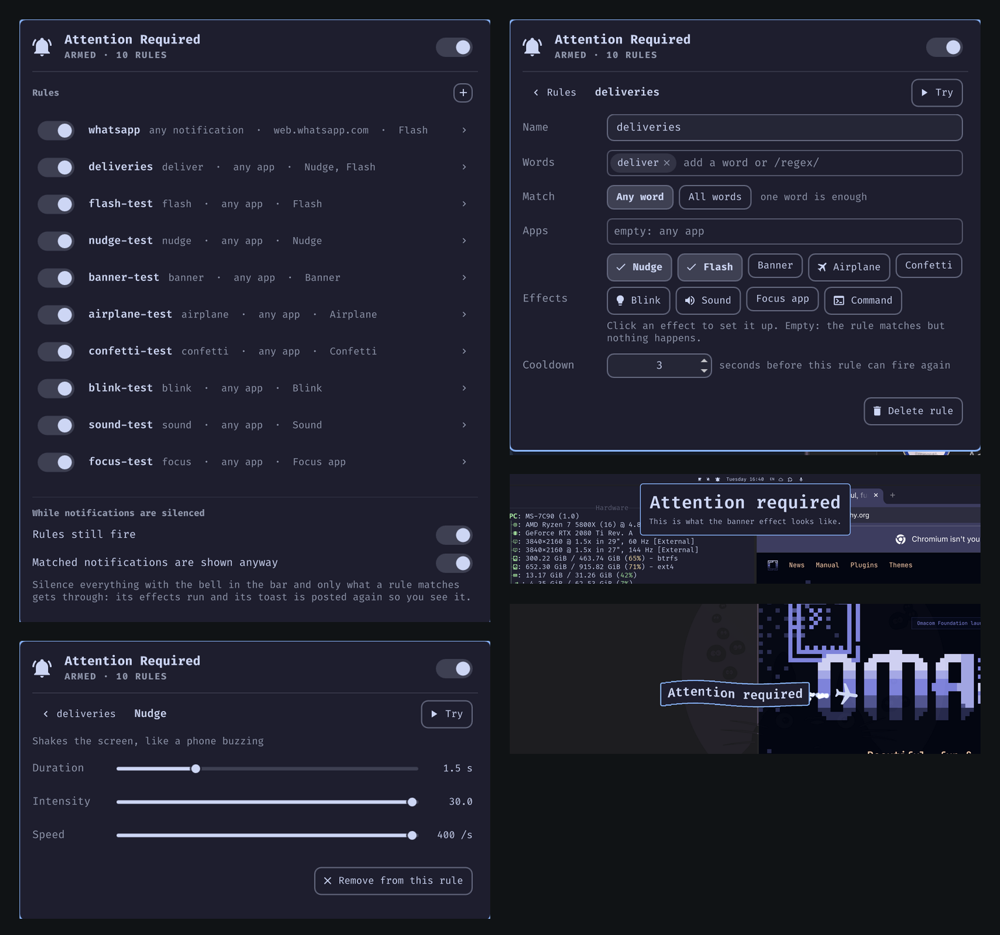

# Attention Required

Silence your notifications and let only the ones that matter through, loudly.
Rules watch every notification for words and apps; a match runs effects you
cannot miss: the MSN Messenger **nudge** that shakes the screen, a **flash**,
a **banner**, an **airplane** towing the message, **confetti**, a **blink**, a
**sound**, focusing the app, or a command of yours. While notifications are
silenced, only what a rule matches gets through, toast and all.



> Video of the demo: coming soon.

> Tested on **Omarchy 4** (Arch Linux, Hyprland with the Lua config, omarchy-shell).

## Install

```bash
omarchy plugin add https://github.com/alanfortlink/attention-required.git --enable
```

A bell appears in the bar. Click it for the settings, right-click it to pause
or resume every effect. A first rule is there to start: any notification that
mentions **deliveroo** shakes the screen.

Runtime dependencies, all part of a stock Omarchy: `jq`, `busctl` (systemd),
`hyprctl`, `notify-send`, `pw-play` (for the sound). `./install.sh` is an
optional helper for a checkout somewhere else: it links the plugin into
`~/.config/omarchy/plugins`, puts the `attention-required` command on your
PATH and enables the bell. `omarchy plugin add` never runs it.

## Settings

Three pages behind the bell:

1. **Rules**: one line each, on/off, click to open, plus button to add. At the
   bottom: whether rules fire while notifications are silenced, and whether a
   matched notification is shown anyway.
2. **One rule**: name; words as chips (`/regex/` works); any word or all words;
   apps as chips, with suggestions from the apps that have sent notifications,
   the ones running, and the ones installed; the effects; the cooldown. Every
   field says what empty means (no words: any notification; no apps: any app).
3. **One effect of that rule**: its sliders and choices, a **Try** button, and
   **Remove from this rule**. Click an effect on the rule page to turn it on
   and land here. Every rule carries its own settings for each effect.

Tab walks the fields in screen order, Esc goes back a page. In a chip field,
Enter or comma adds, Backspace on an empty entry removes the last chip, and
arrows pick a suggestion.

## The rules file

Everything lives in `~/.config/attention-required/rules.json`; the popup
writes it, hand edits reload on save, and it is the thing to keep in your
dotfiles (`attention-required export FILE` / `import FILE`).

```json
{
  "version": 1,
  "whileDnd": true,
  "letThrough": true,
  "rules": [
    { "name": "deliveries", "words": ["deliveroo", "/order #\\d+/"], "effects": ["nudge"], "cooldown": 5 },
    { "name": "boss", "words": ["urgent", "asap"], "apps": ["Slack"], "match": "all",
      "effects": ["flash", { "type": "banner", "duration": 6, "position": "center" }, "sound"] }
  ]
}
```

| Field | Meaning |
|---|---|
| `words` | Case-insensitive substrings of the title or body; `"/…/"` is a regex. Empty: any notification. |
| `match` | `"any"` (default) or `"all"`. |
| `apps` | Substrings of the sending app's name (`"chrome"` matches `Google Chrome`). Empty: any app. |
| `effects` | Names, or objects with a `type` and options. `[]` matches but does nothing. |
| `cooldown` | Seconds before the rule can fire again (3). |
| `enabled` | `false` keeps the rule without using it. |

A top-level `"defaults": { "nudge": { "intensity": 6 } }` block applies to every rule
that does not set the option itself.

## Effects

| Effect | What it does | `duration` | `intensity` | `speed` | More |
|---|---|---|---|---|---|
| `nudge` | The screen shakes, phone-buzz style, through a Hyprland screen shader. `intensity` 6, `speed` 15 is the MSN nudge. | seconds (1) | how far, 0.5..30 (1.5) | positions per second (200) | |
| `flash` | A glow pulses in from the edges. | seconds (1) | 0..1 (0.9) | pulses per second (3) | `thickness` px (64), `color` |
| `banner` | The message drops in as a big card. | seconds it stays (3) | size (1) | slide speed (4) | `position`: top, center, bottom; `color`; `text` template |
| `airplane` | A plane bobs across the screen, trailing exhaust, towing the message on a rippling flag. | flight seconds (7) | size (1) | | `altitude` 0..1 (0.2), `direction`: ltr, rtl; `text` |
| `confetti` | Confetti in the theme's colours. | seconds (1) | amount (1) | launch power (1) | `style`: cannons (bottom corners, up), burst (centre), rain (top) |
| `blink` | The screen dims and comes back. | seconds (1) | darkness 0..1 (0.6) | blinks per second (2) | |
| `sound` | Plays a chime with `pw-play`. | | volume (1) | times (1) | `file` |
| `focus` | Brings the sending app's window to the front. | | | | `window`: a class or title instead |
| `command` | Runs a shell command. | | | | `run`; sees `AR_APP`, `AR_SUMMARY`, `AR_BODY`, `AR_RULE`, every option as `AR_OPT_<NAME>` |

`color` is `accent`, `urgent`, `foreground` or any CSS color. Text templates
take `{summary}`, `{body}`, `{app}`, `{rule}`. Your own effect is an executable
in `~/.config/attention-required/effects/<name>` with the same environment.

## Command line

```
attention-required list | add NAME --words a,b --apps x --effects nudge,flash | remove NAME
attention-required enable NAME | disable NAME | toggle | on | off | settings
attention-required test banner | test '{"type":"nudge","intensity":6,"speed":15}'
attention-required simulate "Google Chrome" "Your rider has arrived" "deliveroo.co.uk"
attention-required set nudge intensity 6 | status | export [FILE] | import FILE | edit
./demo.sh              # a narrated tour of every effect, driven by real notifications
```

## What it runs and touches

- Notifications are read from the session bus with `busctl monitor` (every
  `Notify` call), so nothing is missed while silenced; there is no notification
  daemon of its own and no network access. Messages over 256 KB are dropped and
  fields are clipped before anything looks at them.
- A match while silenced is posted again as a critical `notify-send`, the one
  kind Omarchy shows through Do Not Disturb; the plugin recognises its copy.
- The nudge sets Hyprland's `decoration.screen_shader` and turns
  `debug.damage_tracking` off for the shake through `hyprctl eval`, restoring
  both after; `focus` dispatches a window focus. Nothing under `~/.config/hypr`
  is written.
- The `command` effect runs whatever `run` says, as you, with the notification
  in the environment. Only import a rules file you trust.
- No sudo, no package installs, no downloads. State: `~/.config/attention-required/`
  (rules, your effects), `~/.local/state/attention-required/paused`,
  `$XDG_RUNTIME_DIR/attention-required/` (the shader).

## Uninstall

```bash
omarchy plugin remove alanfortlink.attention-required    # or ./install.sh --uninstall
```

Your rules are left in `~/.config/attention-required`; delete that folder to
remove everything.

## Development

`node tests/rules.test.js` checks the matching. A saved QML file reloads in the
shell; `Service.qml` and `Rules.js` need `omarchy restart shell`.
`journalctl --user -f | grep attention-required` shows what it is doing.

MIT license.
